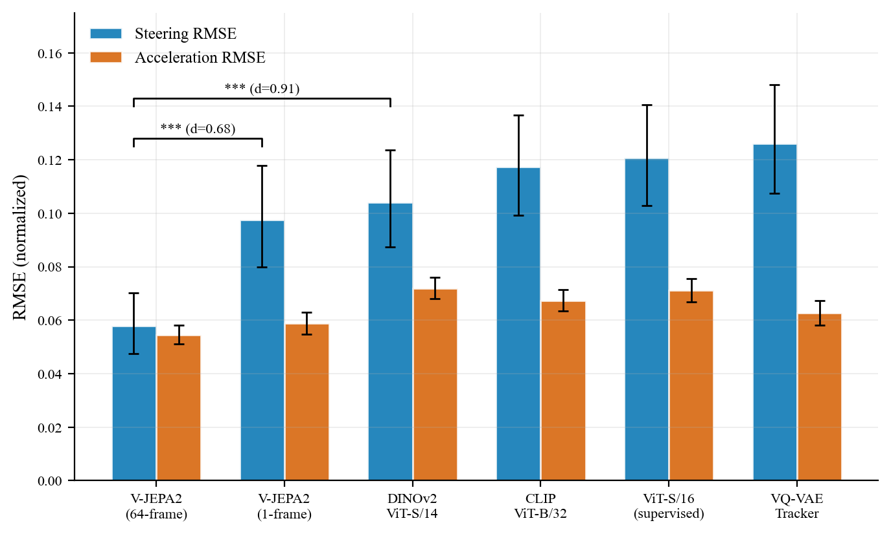
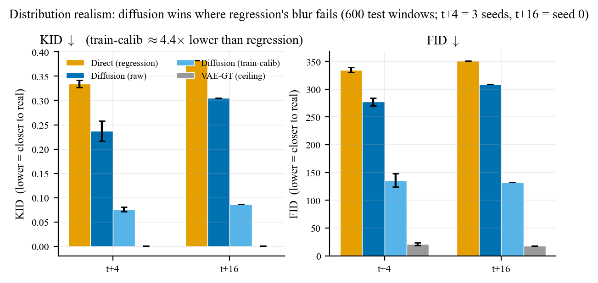
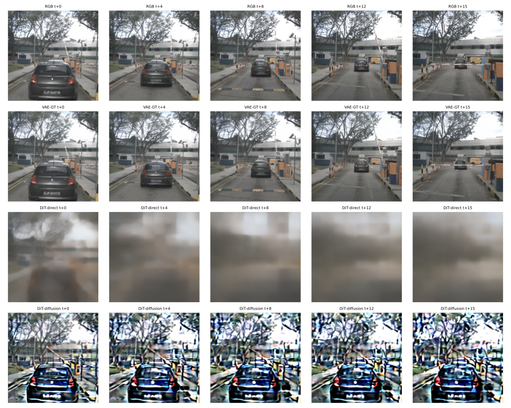

<div align="center">
<h1>Diffusion Transformer World-Action Model for AV Scene Prediction</h1>


<br>

Ruslan Sharifullin, Benjamin Jiang, Kai Xi Chew
<br>
*Department of Computer Science*
<br>
*Stanford University*

</div>

**Diffusion Transformer World-Action Model for AV Scene Prediction** is an autoregressive video-action prediction framework for autonomous driving. We train a **VAE-Latent Diffusion Transformer (DiT)** jointly on video sequences and CAN-bus ego-actions from nuScenes. By organizing video and action streams into a unified temporal sequence under a diffusion objective, the model learns the complex multi-modal distributions of future traffic scenarios, enabling highly realistic, action-controllable future video generation that overcomes the blurry mean-regression problem of standard spatial models.

## Highlights

### 1. Visual Priors for Action Prediction
Before building the world model, we establish a rigorous linear-probing frontier across five foundation models. We find that structurally-aware, joint-embedding predictive architectures (V-JEPA2) and self-supervised vision transformers (DINOv2) significantly outperform CLIP and VQ-VAE in capturing the spatial semantics necessary for autonomous driving.

<div align="center">
  
</div>

### 2. Spatial vs. Latent Diffusion World Models

We implement and evaluate two major architectures for future-state prediction:
* **Spatial DiT (Direct/Residual)**: Operates on raw spatial grids from ViT/DINOv2. High semantic cosine similarity but struggles with visual blurriness over long horizons.
* **VAE-Latent Diffusion**: Adapts a Stable Diffusion v1.5 VAE latent space into an autoregressive policy. Trades some raw cosine similarity for dramatically better image fidelity (FID/KID) and physical realism.

<div align="center">

| Model Formulation | Latent CosSim (15-step) ↑ | FID ↓ | KID (mean) ↓ |
|---|---|---|---|
| **Direct DiT (Spatial)** | **0.4708** | 370.77 | 0.3748 |
| **Diffusion DiT (VAE)** | 0.2597 | **162.50** | **0.0782** |
| *Interpolated (Diffusion + Caltrain)* | 0.3162 | 166.55 | 0.0839 |

</div>

<div align="center">
  
</div>

### 3. Action Controllability & Generative Realism

A critical test of a World-Action Model is whether its predicted futures obey the injected action commands. We sweep steering inputs [-0.28, 0.21] and measure the resultant lateral shift in the generated video.

<div align="center">

| Architecture | Steering-to-Shift Spearman Rank ρ ↑ | Monotone Correctness |
|---|---|---|
| **Direct/Residual DiT** | -0.1806 | 35.9% |
| **VAE-Latent Diffusion** | **0.8131** | **100.0%** |

</div>

The diffusion model strongly respects action inputs (perfect monotonic consistency), whereas direct regression models ignore the action and average out to blurry straight-ahead paths.

### 4. Qualitative Rollouts

Our autoregressive VAE-Latent Diffusion model maintains sharp image quality over multi-second rollouts (15 steps = ~7.5 seconds) while predicting future states conditioned on ego-actions.

<div align="center">



</div>

### 5. Evaluation Suite

We provide a comprehensive, extensible evaluation harness designed to rigorously test world model dynamics:
* **Latent Cosine Similarity (`evaluation/latent_eval.py`)**: Computes semantic drift over long horizons by comparing the unrolled trajectory embeddings against ground-truth encoded sequences.
* **Environmental Robustness (`evaluation/metrics.py`)**: Uses non-parametric bootstrapping with 95% Confidence Intervals to measure steering and acceleration RMSE degradation under night and rain conditions.
* **Generative Metrics**: Evaluates physical realism of the World-Action Model rollouts using FID, KID, and LPIPS over 15-frame autoregressive horizons.

## Getting Started

### Installation

```bash
# Python 3.11 recommended
git clone <repo-url>
cd latent-world-models-av

# Create and activate virtual environment
python -m venv .venv && source .venv/bin/activate
pip install -r requirements.txt

# Verify your local contract and environment
python scripts/utils/check_canonical_contract.py

# Run the correctness tests
PYTHONPATH=. pytest -q
```

### Reproducibility & The Canonical Contract

This repository enforces strict reproducibility through a central configuration contract. 

1. **`configs/canonical.yaml`**: Do not hardcode splits, seeds, normalization constants, or hyperparameters. Always use `config.load_canonical()`.
2. **Artifact Sidecars**: Every numeric result produced in scripts must output a JSON/CSV to `artifacts/full/`. Figures are generated directly from these sidecars.
3. **Continuous Integration**: CI runs `check_canonical_contract.py` and Pytest on every PR to ensure all metrics map exactly to the tracked artifacts.

### Dataset Preparation

The action labels CSV (`camfront_keyframe_actions.csv`) is required. 
The full nuScenes dataset (raw images, CAN bus expansion) is expected at `$NUSCENES_DATAROOT`.
We support two splits: `v1.0-mini` (smoke tests) and `v1.0-trainval` (frozen 180-train/20-val/40-test split). See `docs/CANONICAL_ARTIFACTS.md` for details.

## Checkpoints and Storage

Pre-trained model weights, VAE latents, and full-grid spatial embeddings are hosted on Hugging Face:
* `surlac/lwm-av-checkpoints`: DiT weights, VAE weights, and robust evaluation metrics.
* `surlac/lwm-av-embeddings`: Pre-extracted `.npz` sequence arrays.

You can download these artifacts directly from the Hugging Face repositories using the standard `huggingface_hub` CLI.
